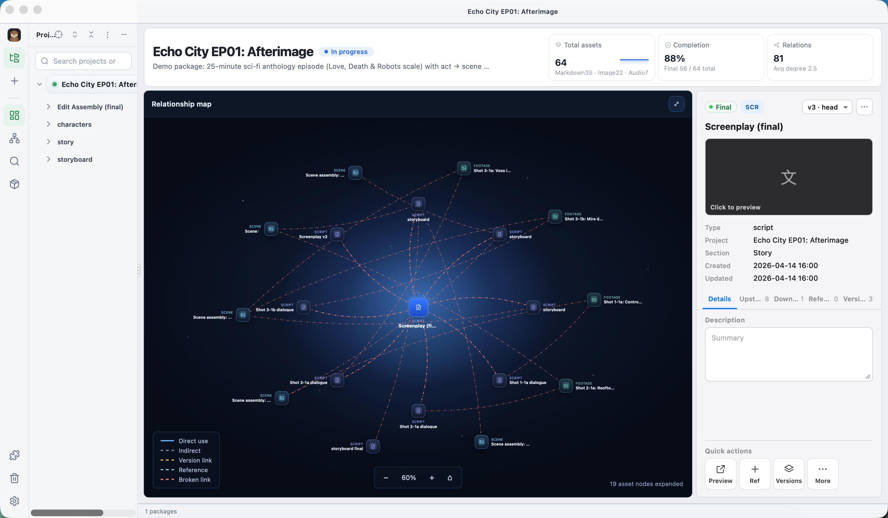
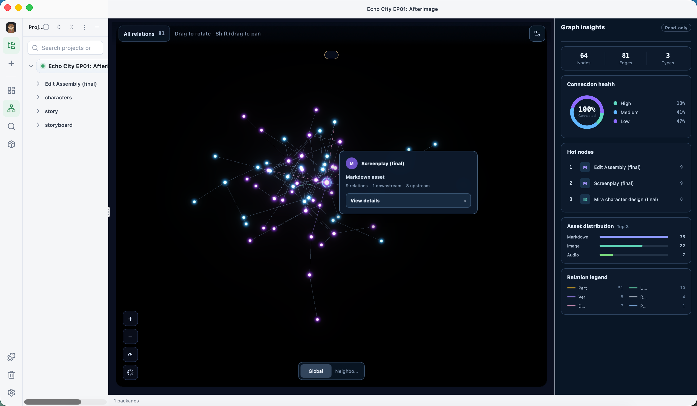
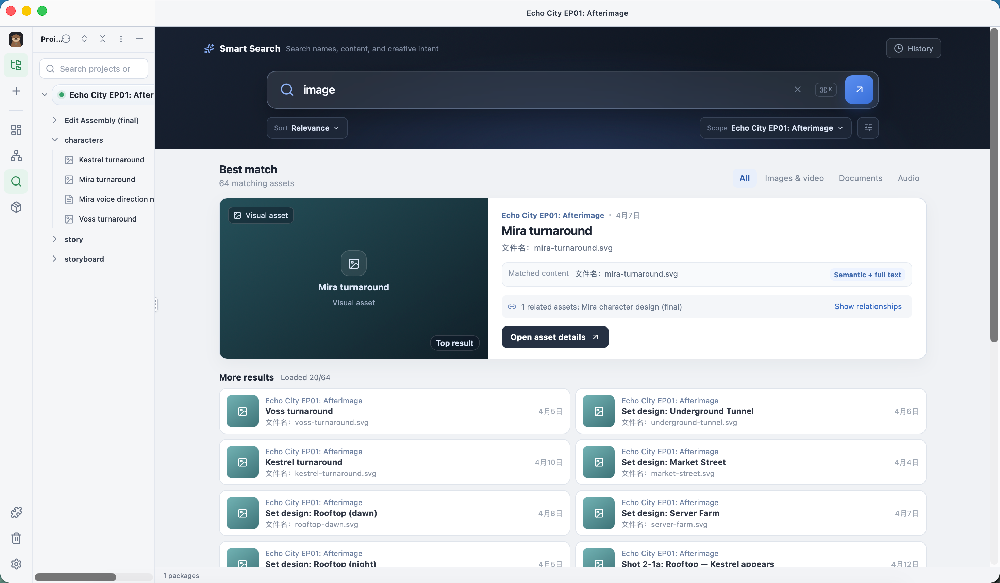
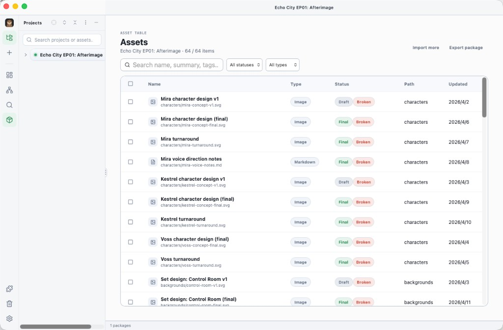

# WorkBOM

**Local-first content management for AI-era materials.**

WorkBOM helps **content workers** — writers, designers, editors, and video teams — organize the flood of AI-assisted drafts, images, audio, scripts, and revisions into one navigable project library.

Import `.wbom` packages, keep links to the original files on disk, and manage materials with relationships, versions, search, and a knowledge graph — without uploading your source files.

> Early Preview · macOS Apple Silicon · Windows x64 · MIT · No telemetry · Your files stay local

[](docs/images/demo.mp4)

> Demo video: [docs/images/demo.mp4](docs/images/demo.mp4) · click the image above to open it.

## Who it’s for

If you make content with AI in the loop, materials scatter fast across chats, folders, and tools. WorkBOM is for:

| Role | What you manage |
| --- | --- |
| **Writers** | Outlines, scripts, notes, revisions |
| **Designers** | Concepts, turnarounds, set art, reference boards |
| **Editors** | Assembly cuts, delivery notes, version heads |
| **Video / audio** | Shots, animatics, scores, voice direction |

Same problem across roles: **what belongs together, what’s current, and how pieces relate.**

## Why WorkBOM?

AI tools generate volume. Folders and file names alone don’t explain structure.

WorkBOM turns scattered AI materials into a **content library**:

- Import structured `.wbom` packages (project + links, not a file dump)
- Browse text, image, and audio materials without copying originals
- Track **part-of / version / reference / use** relationships
- Explore the project as a **3D knowledge graph**
- Search by name, metadata, and local semantic intent
- Spot broken links and reconnect moved files
- Soft-delete and restore from a local trash

## Screenshots

| Project cockpit | Knowledge graph |
| --- | --- |
|  |  |

| Smart search | Asset table |
| --- | --- |
|  |  |

## Early Preview scope

| Area | Included |
| --- | --- |
| Project library | Import and manage `.wbom` packages |
| Content cockpit | Metrics, relationship map, metadata and status |
| Knowledge graph | Relation filters, focus views, graph insights |
| Smart search | Full-text + local semantic retrieval |
| Asset operations | Preview, open, reveal in Finder / Explorer, rename, reconnect, relate |
| Recovery | Soft delete, restore, permanent deletion |
| Official plugin | **Create Project** — generate importable `.wbom` from Cursor / Codex / Claude / workBuddy |

## Download

Prebuilt builds: [GitHub Releases](https://github.com/zhaoe692-lang/work-boms/releases)

### macOS (Apple Silicon)

1. Download `WorkBOM_<version>_aarch64.dmg`
2. Open the DMG and drag **WorkBOM** into **Applications**
3. If macOS blocks the unsigned preview: **System Settings → Privacy & Security → Open Anyway**
4. Import a `.wbom` package from the project sidebar

### Windows (x64)

1. Download `WorkBOM_<version>_x64-setup.exe`
2. Run the installer
3. If SmartScreen appears: **More info → Run anyway**
4. Import a `.wbom` package from the project sidebar

Unsigned preview builds (not code-signed / notarized yet).

## Privacy

- No telemetry, analytics, accounts, or cloud sync
- Indexes and app state live in the OS application-data directory
- Source materials are linked, not uploaded or duplicated into the library
- Semantic search runs locally with a bundled embedding model

## What is a `.wbom` package?

A content package directory: manifest + optional relations / works / identities. Entries point at files via relative or absolute paths.

```text
project.wbom/
├── manifest.json
├── relations.json
├── works.json
└── identities.json
```

Use the in-app **Create Project** plugin to generate packages from AI agent sessions, then import them into WorkBOM.

## Build from source

Requirements: Node.js 20+, Rust stable. On macOS also Xcode CLT; on Windows, MSVC / Visual Studio Build Tools and WebView2.

```bash
npm install
npm test
npm run tauri dev
```

```bash
# macOS local package helper
npm run build:app
```

```bash
# Windows NSIS installer
npm run tauri -- build --bundles nsis
```

CI also builds Windows via GitHub Actions (`Build Windows` workflow).

### Embedding model

Bundled under `src-tauri/resources/models/bge-small-zh-v1.5-int8/` (see `MODEL_LICENSE.md`). Restore with:

```bash
./scripts/fetch-embedding-model.sh
```

## Known limitations

- Unsigned preview: macOS Gatekeeper / Windows SmartScreen may warn
- Inspiration Board may be incomplete or hidden in Early Preview
- When filing Issues, do **not** attach private source files, keys, or confidential project data

## License

MIT — see [LICENSE](./LICENSE).

## 中文简介

WorkBOM 是面向 **内容工作者**（写作、设计、剪辑、影视等）的本地 AI **素材 / 内容管理** 工作台：把 AI 协作产生的文稿、图像、音频与版本收成可浏览、可检索、有关系的项目库。文件留在本机，不上传。当前 Early Preview 提供 **macOS Apple Silicon** 与 **Windows x64** 预构建包。
